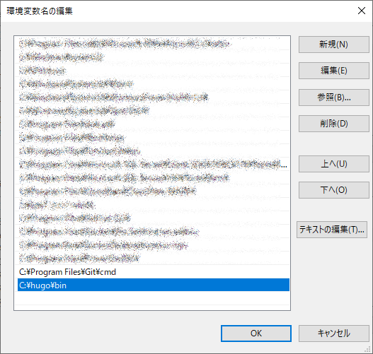
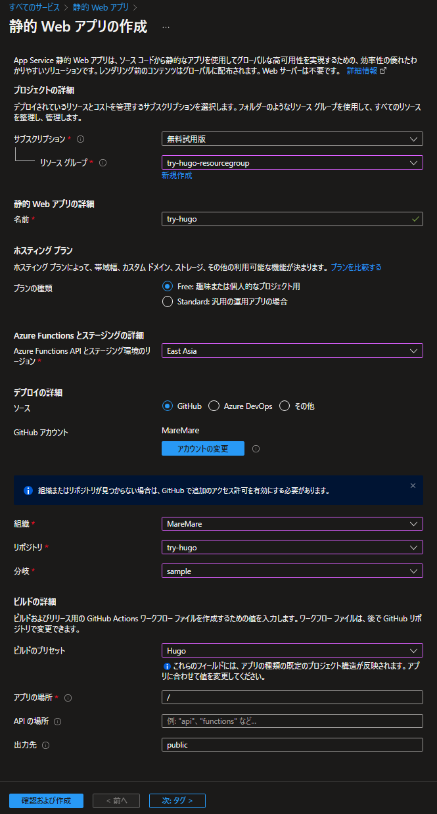
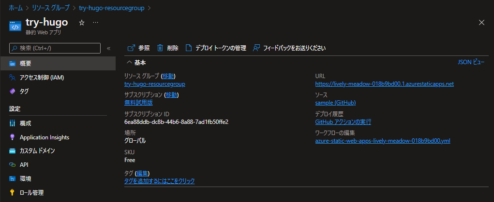

# try-hugo
おためし


## インストール
[Install Hugo \| Hugo](https://gohugo.io/getting-started/installing/#windows)

* [Release v0\.101\.0 · gohugoio/hugo](https://github.com/gohugoio/hugo/releases/tag/v0.101.0)
  * [hugo_0.101.0_Windows-64bit.zip](https://github.com/gohugoio/hugo/releases/download/v0.101.0/hugo_0.101.0_Windows-64bit.zip)
  * [hugo_extended_0.101.0_Windows-64bit.zip](https://github.com/gohugoio/hugo/releases/download/v0.101.0/hugo_extended_0.101.0_Windows-64bit.zip)

1. `hugo_0.101.0_Windows-64bit.zip` を `c:\hugo\bin` へ展開

    展開後：
    ```ps1
    C:\HUGO
        └─bin
            hugo.exe
            LICENSE
            README.md
    ```

2. `c:\hugo\bin` へ PATH を通す

    

3. 確認

    ```ps1
    hugo version
    ```

## Quick Start
[Quick Start \| Hugo](https://gohugo.io/getting-started/quick-start/)

### Create a Hugo App
1. Create a New Site
    ```ps1
    hugo new site quickstart
    ```
2. Add a Theme
    ```ps1
    cd quickstart
    # git init
    git submodule add https://github.com/theNewDynamic/gohugo-theme-ananke.git themes/ananke
    echo 'theme = "ananke"' >> config.toml
    ```

    ```ps1
    code config.toml
    ```

    ```toml
    baseURL = 'http://example.org/'
    languageCode = 'en-us'
    title = 'My New Hugo Site'
    theme = 'ananke'
    ```
3. Add Some Content
    ```ps1
    hugo new posts/my-first-post.md
    ```
4. Start the Hugo server
    ```ps1
    hugo server -D
    ```
5. Build static pages
    ```ps1
    hugo -D
    ```
6. Remove static pages
    ```ps1
    rm public -Recurse -Force
    ```
7. Commit changes & push...
    ```ps1
    git add -A
    git commit -m "add quickstart"
    ```
### Deploy your web app
1. Create the application

    

    | 項目               | 設定値                        |
    |--------------------|-------------------------------|
    | サブスクリプション | 無料試用版                    |
    | リソースグループ   | (新規) try-hugo-resourcegroup |
    | 名前               | try-hugo                      |
    | プランの種類        | Free: 趣味または個人的なプロジェクト用 |
    | 地域               | East Asia                     |
    | デプロイのソース   | GitHub                        |
    | GitHubアカウント   | 自分のGitHubアカウント        |
    | 組織               | 自分の組織                    |
    | リポジトリ         | try-hugo                      |
    | 分岐               | sample                        |
    | ビルドのプリセット | Hugo                          |
    | アプリの場所       | /quickstart                   |
    | APIの場所          |                               |
    | 出力先             | public                        |

2. Wait for GitHub workflow to complete

    `.github/workflows/azure-static-web-apps-lively-meadow-018b9bd00.yml`

    <details>
    <summary>ワークフローの詳細:</summary>
    <div>

    ```yml
    name: Azure Static Web Apps CI/CD
    
    on:
      push:
        branches:
          - sample
      pull_request:
        types: [opened, synchronize, reopened, closed]
        branches:
          - sample
    
    jobs:
      build_and_deploy_job:
        if: github.event_name == 'push' || (github.event_name == 'pull_request' && github.event.action != 'closed')
        runs-on: ubuntu-latest
        name: Build and Deploy Job
        steps:
          - uses: actions/checkout@v2
            with:
              submodules: true
          - name: Build And Deploy
            id: builddeploy
            uses: Azure/static-web-apps-deploy@v1
            with:
              azure_static_web_apps_api_token: ${{ secrets.AZURE_STATIC_WEB_APPS_API_TOKEN_WHITE_SMOKE_09AD8AF00 }}
              repo_token: ${{ secrets.GITHUB_TOKEN }} # Used for Github integrations (i.e. PR comments)
              action: "upload"
              ###### Repository/Build Configurations - These values can be configured to match your app requirements. ######
              # For more information regarding Static Web App workflow configurations, please visit: https://aka.ms/swaworkflowconfig
              app_location: "/quickstart" # ⬅️ App source code path
              api_location: "" # Api source code path - optional
              output_location: "public" # Built app content directory - optional
              ###### End of Repository/Build Configurations ######
    
      close_pull_request_job:
        if: github.event_name == 'pull_request' && github.event.action == 'closed'
        runs-on: ubuntu-latest
        name: Close Pull Request Job
        steps:
          - name: Close Pull Request
            id: closepullrequest
            uses: Azure/static-web-apps-deploy@v1
            with:
              azure_static_web_apps_api_token: ${{ secrets.AZURE_STATIC_WEB_APPS_API_TOKEN_WHITE_SMOKE_09AD8AF00 }}
              action: "close"
    ```

    </div>
    </details>

3. Azure Static Site check

    

## 参考
* [チュートリアル:Hugo サイトを Azure Static Web Apps に発行する \| Microsoft Docs](https://docs.microsoft.com/ja-jp/azure/static-web-apps/publish-hugo)
* [Install Hugo \| Hugo](https://gohugo.io/getting-started/installing/#windows)
* [Quick Start \| Hugo](https://gohugo.io/getting-started/quick-start/)
* [Hugo と Github Pages でブログを作る – 三日坊主。](https://sat8bit.github.io/posts/hugo-with-github-pages/)
* [Hugoで1からテーマを作ってGitHub Pagesにデプロイする \| メンバーズエッジカンパニーブログ](https://www.membersedge.co.jp/blog/create-hugo-theme-and-deploy-to-github-pages/)

